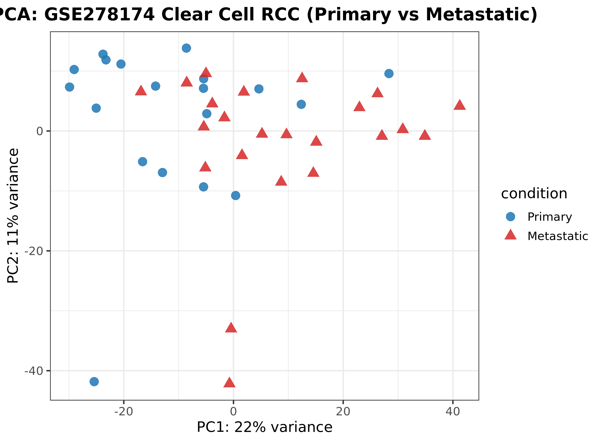
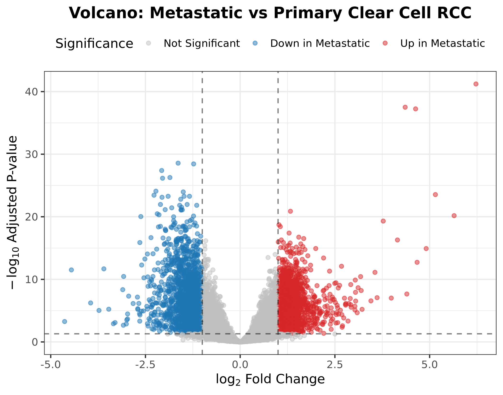
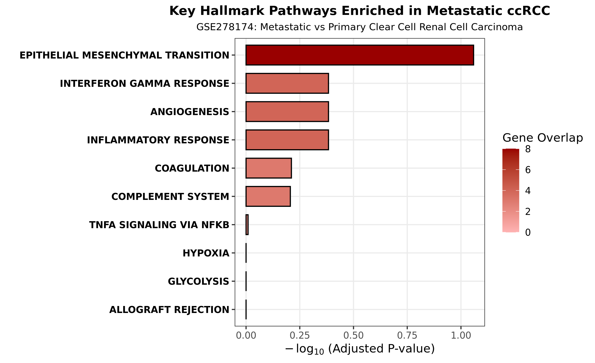

# Clear Cell Renal Cell Carcinoma (ccRCC) Progression & Metastasis Analysis

An end-to-end biostatistical and transcriptomic profiling pipeline analyzing differential gene expression and functional pathway activation in primary versus metastatic clear cell renal cell carcinoma (ccRCC), based on the clinical cohort from **Dr. Simpa S. Salami** (University of Michigan Rogel Cancer Center; NCBI GEO: [GSE278174](https://www.ncbi.nlm.nih.gov/geo/query/acc.cgi?acc=GSE278174)).

---

## 🔬 Dataset & Clinical Cohort Summary

| Metric / Parameter | Value |
| :--- | :--- |
| **GEO Accession** | [GSE278174](https://www.ncbi.nlm.nih.gov/geo/query/acc.cgi?acc=GSE278174) |
| **Total Patient Samples** | **42** biologically independent ccRCC tissues |
| **Experimental Design** | **19 Primary ccRCC** vs **23 Metastatic ccRCC** |
| **Quantification Platform** | RNA-Seq Raw Counts (14,971 genes profiled) |
| **Target Investigator** | Dr. Simpa S. Salami, MD, MPH (U-M Rogel Cancer Center) |

---

## 📊 Analytical Highlights & Key Findings

- **Statistical Modeling:** Variance-stabilizing transformation (VST) and negative binomial Generalized Linear Model (GLM) via DESeq2.
- **Transcriptomic Dysregulation:** Identified **1,713 Up-regulated** and **1,747 Down-regulated** genes in metastatic lesions compared to primary tumors ($|\log_2\text{FC}| \ge 1$, $\text{FDR} < 0.05$).
- **Hallmark Pathway Enrichment:** Significant activation of **Epithelial-Mesenchymal Transition (EMT)** ($p = 0.0087$, 8 key driver genes) and **Interferon Gamma Response** ($p = 0.0381$), delineating the invasive phenotypic switch driving ccRCC metastasis.

---

## 📈 Publication Figures

| Sample Segregation (PCA) | Global Transcriptomic Shift (Volcano) | Hallmark Enrichment |
| :---: | :---: | :---: |
|  |  |  |

---

## 📁 Project Structure
```text
ccRCC_GSE278174_salami/
├── data/
│   ├── metadata/
│   │   └── coldata.tsv                           # Curated sample design matrix (42 samples)
│   └── rawcounts/
│       └── GSE278174_rawcounts.tsv               # Raw expression counts (14,971 genes)
├── results/
│   ├── deseq2/
│   │   ├── differential_expression_Metastatic_vs_Primary.csv # Full DEG statistics
│   │   └── pathway_hallmark_metastatic_up.csv    # Functional pathway enrichment rankings
│   └── plots/
│       ├── pca_plot_primary_vs_metastatic.png   # 300 DPI PCA ordination
│       ├── volcano_plot.png                      # 300 DPI annotated Volcano plot
│       └── hallmark_pathways_up.png              # 300 DPI Hallmark enrichment barplot
├── scripts/
│   ├── 00_fetch_geo_metadata.R                   # Metadata parsing and integrity verification
│   ├── 01_deseq2_analysis.R                      # Normalization, statistical testing, plotting
│   └── 02_pathway_enrichment.R                   # Standalone MSigDB Hallmark Fisher exact test
├── .gitignore
└── README.md
⚙️ Environment Setup & Reproducibility
bash
# Clone the repository
git clone https://github.com/shayesteh68/ccRCC_GSE278174_salami.git
cd ccRCC_GSE278174_salami

# Activate the dedicated biostatistical environment
conda activate r_deseq_env

# Step 1: Run DESeq2 differential expression modeling & QC plots
Rscript scripts/01_deseq2_analysis.R

# Step 2: Run Hallmark pathway enrichment analysis
Rscript scripts/02_pathway_enrichment.R
👤 Author & Contact
Narges Shayesteh

Bioinformatician & RNA-Seq Data Specialist

LinkedIn: linkedin.com/in/narges-shayesteh
GitHub: @shayesteh68
